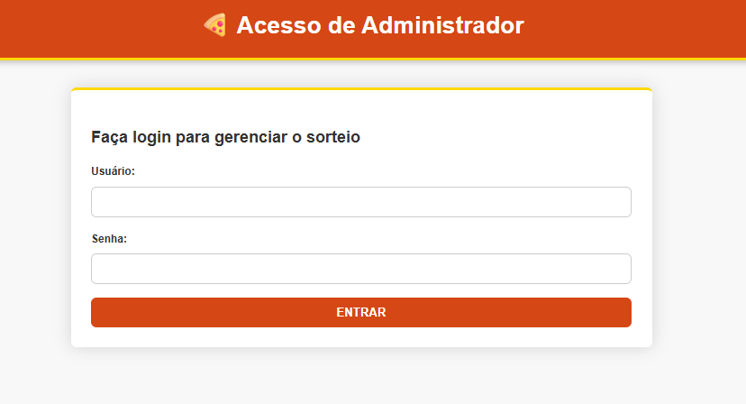
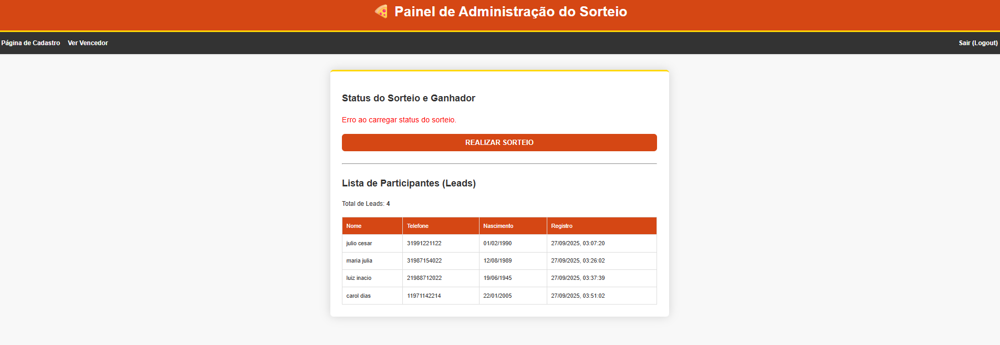
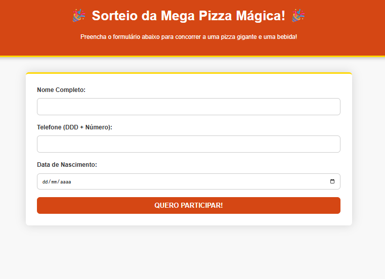
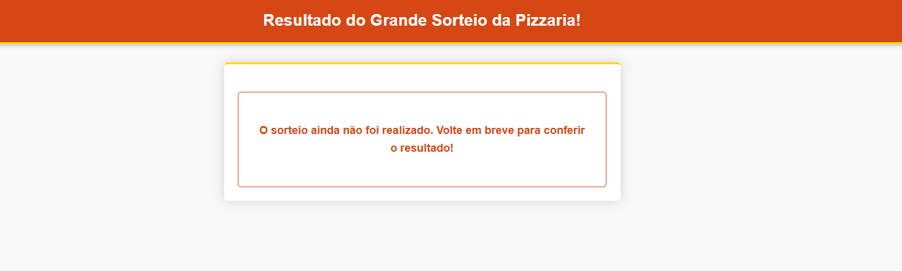

# 🍕 Documentação do Sistema de Sorteio de Pizzaria (MVP)

## 🌟 Visão Geral

Este projeto é um sistema Mínimo Viável (MVP) de cadastro de leads e sorteio, construído em Node.js (Express), JavaScript puro e HTML/CSS.

O sistema controla a duplicidade de participantes pelo telefone, protege a área administrativa por meio de Login/Senha (JWT) e permite agendar o sorteio para uma data futura, garantindo transparência e controle.

---

## Imagens do projeto









---

## 🛠️ Configuração e Instalação

Siga estes passos para configurar o projeto e colocá-lo em funcionamento em seu ambiente local.

1. **Pré-requisitos**
Certifique-se de ter o Node.js e o npm instalados em sua máquina.

2. **Instalação de Dependências**
No terminal, na pasta raiz do projeto, instale os pacotes necessários:

```
npm install express body-parser bcrypt jsonwebtoken dotenv
```

3. Configuração de Segurança (Arquivo ```.env```)
Crie um arquivo chamado .env na raiz do seu projeto (no mesmo nível do ```package.json```). Este arquivo armazena as credenciais de forma segura, fora do código-fonte.

Cole o seguinte conteúdo, usando o seu hash gerado localmente para a senha ```admin123``` e definindo a data de agendamento desejada:

```
# .env

# Chave secreta para assinar o JWT (DEVE ser complexa em produção)
JWT_SECRET="sua_chave_secreta_muito_longa_e_aleatoria"

# Credenciais de Administrador
ADMIN_USER="admin"
# IMPORTANTE: Use o hash que você gerou localmente para a senha 'admin123'
ADMIN_PASSWORD_HASH="$2b$10$YnHU12jHbLBvbYJfe6RtTuDrSAydO3w9GVlrEgwYlc/6wHzeRytR2" 

# Data e hora agendada para o sorteio.
# Formato: AAAA-MM-DDTHH:mm:ss (Ex: 2025-10-01T15:30:00)
# O sistema usará esta hora para liberar o botão de sorteio.
LOTTERY_SCHEDULE_TIME="2025-10-01T15:30:00"
```

4. Inicialização do Servidor

Inicie o servidor Node.js:

```
node src/server.js

# Ou se você tiver o comando 'start' no seu package.json:
# npm start
```

O servidor será iniciado em

```
http://localhost:3000.
```

---

## 🚀 Guia de Uso

A. Para Participantes (Público)

```
URL Objetivo Status de Login
http://localhost:3000/index.html Página de Cadastro de Leads. Público
http://localhost:3000/vencedor.html Página para visualizar o resultado final do sorteio. Público
```

B. Para Administradores
Acesso ao Login:
Navegue para a página de login: ```http://localhost:3000/login.html```

Credenciais de Acesso (Teste):

Usuário: ```admin```

Senha: ```admin123```

Painel de Administração (```admin.html```):
Após o login, você acessará o painel com as seguintes funcionalidades:

Listagem de Participantes: Tabela completa com todos os leads cadastrados.

Status do Sorteio: Exibe se o sorteio está Agendado, Pronto ou Concluído.

Botão "Realizar Sorteio":

Ficará desativado se a hora definida em ```LOTTERY_SCHEDULE_TIME``` (no ```.env```) ainda não tiver passado.

Ficará ativo assim que a data agendada for atingida.

Só pode ser executado uma única vez.

---

## ⚙️ Estrutura Técnica do Projeto

```
Arquivo/Pasta Função
.env Armazena variáveis de ambiente sensíveis (segredos, chaves e data de agendamento).
src/server.js Backend: Contém a lógica de rotas, middlewares, JWT e a lógica de agendamento/sorteio.
src/db.js Módulo de persistência de dados (lê/escreve nos arquivos JSON).
data/leads.json Arquivo que armazena todos os leads cadastrados.
data/winner.json Arquivo que armazena o resultado final do sorteio.
public/index.html Página de cadastro (frontend público).
public/login.html Página de autenticação do administrador.
public/admin.js Lógica de autenticação, listagem e controle do sorteio (usa JWT para todas as chamadas).
public/style.css Folha de estilo global com a paleta de cores personalizada.
```

---
